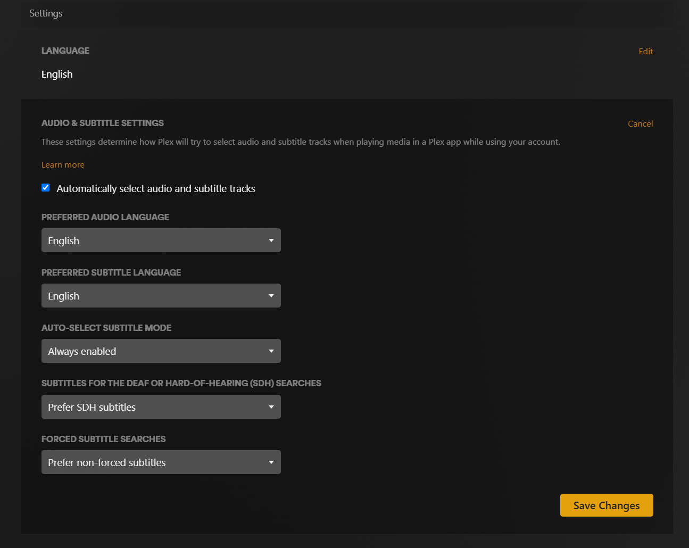

# Account Settings

You can log into your Plex account on the web to update various settings. I recommend _at least_ updating your language and subtitle settings.

## Privacy and Email Subscriptions

Ethan Sholly has put together a good resource for checking Plex's various privacy-related settings, including marketing email preferences, ad partner data usage, playback data, and more: [Optimal Plex Settings for Privacy-Conscious Users](https://selfh.st/post/plex-privacy-settings/)  

> **TIP**
> In case the original article is unavailable, it is archived on [Wayback Machine](https://web.archive.org/web/20250530171740/https://selfh.st/post/plex-privacy-settings/)

## Audio & Subtitle Preferences
If you prefer to use subtitles, you can set that option in your account instead of having to select them every time you watch something:

  1. [Log into your account on the web](https://app.plex.tv/desktop/#!/login), then go to the [Account Settings page](https://app.plex.tv/desktop/#!/settings/account) and scroll down to the "Settings" section
  2. **Set your Language preference:**
     1. Next to "LANGUAGE", click "Edit", select your preferred language, then click "Save Changes" 
  3. **Set your Audio & Subtitle preferences:**
     1. Next to "AUDIO & SUBTITLE SETTINGS" click "Edit"
     2. Select the checkbox for "Automatically select audio and subtitle tracks"
     3. Set your preferred language for audio and subtitles
        * I suggest leaving the audio selection empty — I tend to only keep the original language audio anyway
     4. Select "Auto-Select Subtitle Mode" to "Always Enabled"
     5. The last two boxes are up to you — they only apply if something on Plex *doesn't already have subtitles* and you use its built-in search tool to find some
        * I suggest "Prefer SDH subtitles" (the kind with effects like `[melancholy music]`) and "Prefer non-forced subtitles" ("forced" means foreign dialogue in an otherwise all-English movie)
     6. Select "Save Changes"

You can always change your subtitle selection for any given content while you're watching it.

