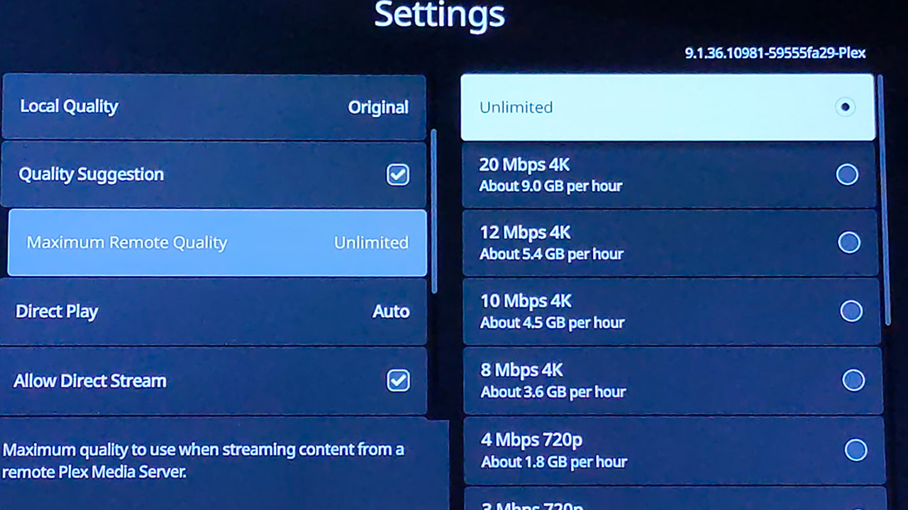
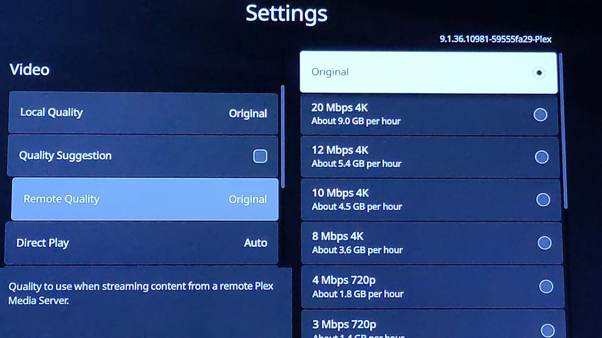

# Updating quality settings

It's important to update the quality settings in your Plex app(s) to make sure you get the best streaming experience.

## iOS/Android app

1. Tap your profile icon in the top right corner of the app
2. Tap "Settings" then select "Video & Audio"
   * Local Quality: `Maximum`
   * Wi-Fi Quality: `Maximum`
   * Allow Direct Play: `On`
   * Allow Direct Stream: `On`

## Other streaming devices (Roku, Fire Stick, etc)

1. In the left-hand menu, select "Settings"
2. In the "Video" section:
   * "Auto Adjust Quality" (if present): `Off`
   * "Local Quality" and "Remote Quality": `Original`
     * On some devices (like Rokus) you may need to **uncheck the "Quality Suggestion" checkbox** first
     * If you do leave the "<a href="https://support.plex.tv/articles/quality-suggestions/" target="_blank">Quality Suggestion</a>" option enabled, even with "Maximum Remote Quality" set to `Unlimited` Plex may try to stream at a lower quality which will likely result in buffering
   * "Allow Direct Play": `On`
   * "Allow Direct Stream": `On`

These may have different names depending on the platform — anywhere it asks for quality levels, set them to `Original` if available or `Maximum` otherwise.

| **Quality Suggestions On by Default** | **Quality Suggestions Turned Off** |
| :--: | :--: |
|  |  |

-----

# Why is this important?

The settings Plex starts with are not great and will likely result in a low-resolution stream that buffers frequently.

Plex apps default to a relatively low `720p` resolution setting, which means that any higher-resolution files have to be converted _down_ to that lower quality before you can watch.  
While my Plex server is working on doing that, your stream is just sitting there waiting to play.

Updating to the "Original" or "Maximum" quality setting means Plex can just send you the original high-quality stream directly without having to convert it.
