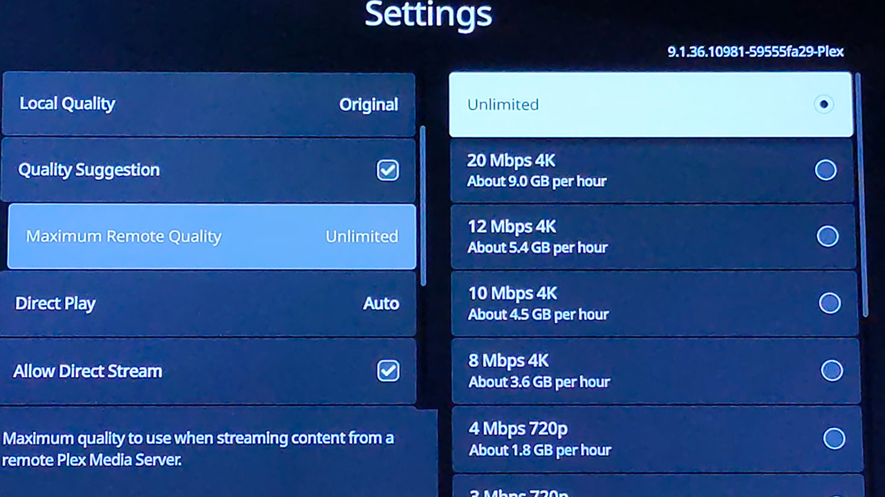
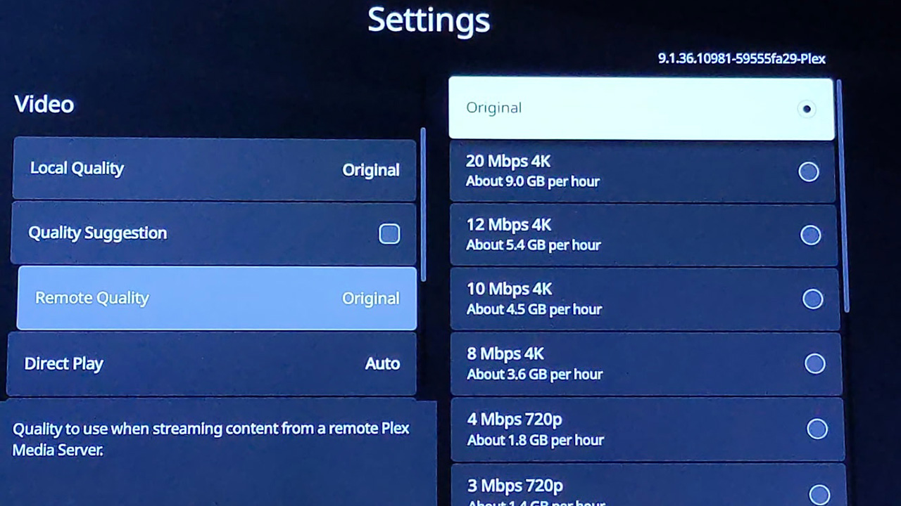

# Updating quality settings

The settings that Plex apps use by default are not great and will likely result in a low-resolution stream that buffers frequently.  
Use the quick steps for your app below to update them and get the best possible experience.

## 📱 iOS/Android app

1. Tap your profile icon in the top right corner of the app
2. Tap "Settings" then select "Video & Audio"
   * Local Quality: `Maximum`
   * Wi-Fi Quality: `Maximum`
   * Allow Direct Play: `On`
   * Allow Direct Stream: `On`

## 📺 Other streaming devices (Roku, Fire Stick, etc)

1. In the left-hand menu, select "Settings"
2. In the "Video" section:
   * "Auto Adjust Quality" (if present): `Off`
   * "Local Quality" and "Remote Quality": `Original`
     * On some devices (like Rokus) you may need to **uncheck the "Quality Suggestion" checkbox** first
     * If you do leave the "<a href="https://support.plex.tv/articles/quality-suggestions/" target="_blank">Quality Suggestion</a>" option enabled, even with "Maximum Remote Quality" set to `Unlimited` Plex may try to stream at a lower quality which will likely result in buffering
   * "Allow Direct Play": `On`
   * "Allow Direct Stream": `On`

These may have different names depending on the platform — anywhere it asks for quality levels, set them to `Original` if available or `Maximum` otherwise.

| 👎 Quality Suggestions _On_ by Default | 👍 Quality Suggestions Turned _Off_ |
| :-- | :-- |
|  |  |
